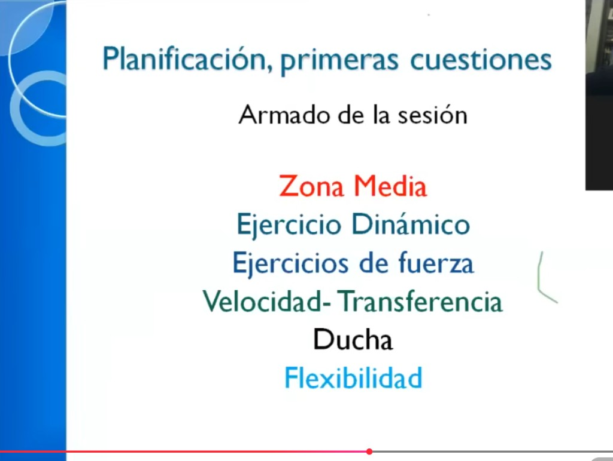
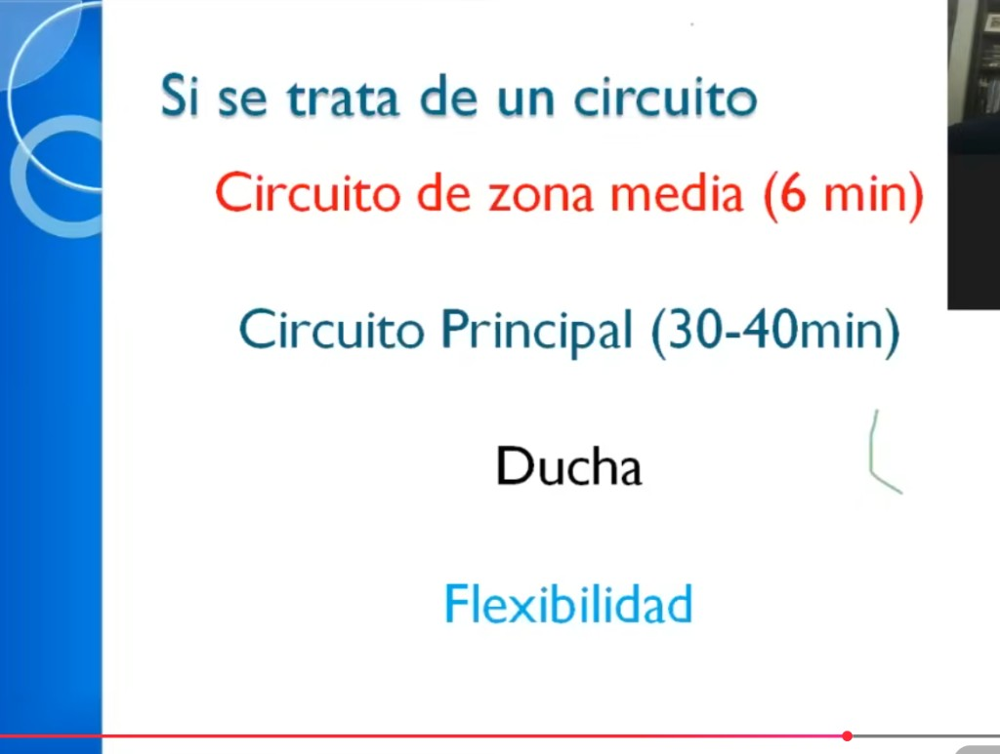
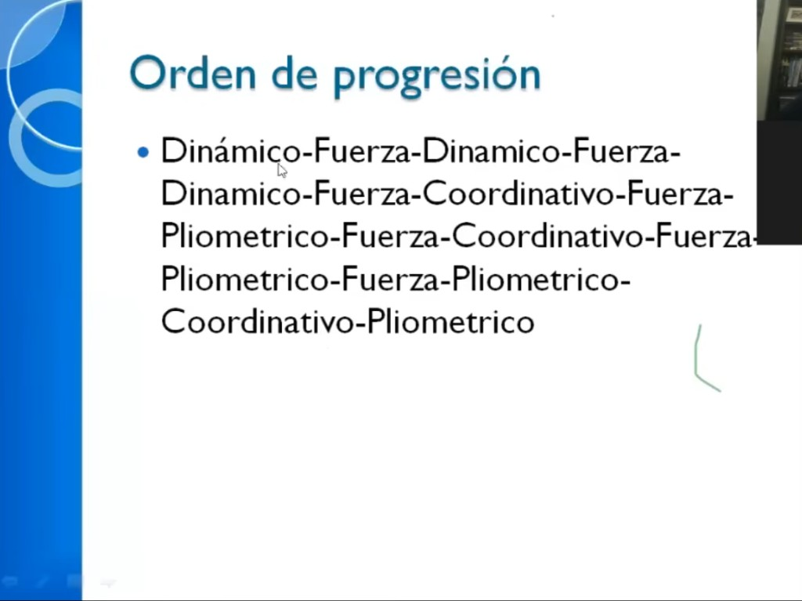
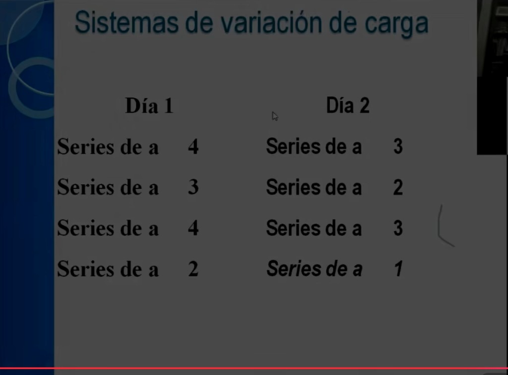

# Armado de la sesión — Anselmi

> Orden dentro de **una sesión** de entrenamiento. No es caprichoso: cada bloque prepara o aprovecha el estado del sistema nervioso y muscular del bloque anterior.



---

## El orden

| # | Bloque | Color | Por qué en ese lugar |
|---|--------|-------|----------------------|
| 1 | **Zona Media** | Rojo | El core se activa primero — antes de cualquier carga externa. Sin zona media activa, todo lo que viene después se ejecuta con transferencia de fuerza deficiente y mayor riesgo lumbar |
| 2 | **Ejercicio Dinámico** | Negro | Movilidad activa, calentamiento fluido — prepara articulaciones y rango de movimiento para la fuerza |
| 3 | **Ejercicios de Fuerza** | Azul oscuro | El trabajo principal — el sistema nervioso está fresco y el cuerpo preparado |
| 4 | **Velocidad / Transferencia** | Verde | Trabajo explosivo (pliométrico, coordinación-arranque-freno) — cuando hay fuerza base activada pero aún hay reserva nerviosa |
| 5 | **Ducha** | Negro | Separador fisiológico |
| 6 | **Flexibilidad** | Azul claro | Estiramiento post-actividad — el músculo caliente es más receptivo al trabajo de rango |

---

## El insight clave: zona media primero

La mayoría de los planes ponen el core al final ("abdominales para terminar"). Anselmi lo invierte: **el core va primero**, porque:

1. El transverso abdominal y los multífidos son los estabilizadores primarios de la columna — si no están activados, cada ejercicio de fuerza que sigue los recluta tarde o los ignora.
2. La zona media fatigada al final de la sesión recibe poco estímulo real — el atleta ya no tiene concentración ni calidad para hacerlo bien.
3. Activar el core primero "enciende" el sistema nervioso central para todo lo que viene después.

---

## Cómo aplica al plan de Diego

| Bloque Anselmi | Equivalente en el plan actual | Estado |
|----------------|------------------------------|--------|
| **Zona media** | Bird dog, dead bug, plancha — bloque propio **antes** del circuito (6 min · 2 rondas) | ✓ |
| **Ejercicio dinámico** | Gato-vaca, piriforme, marcha — **calentamiento** | ✓ |
| **Fuerza** | Circuito A/B + bloque de fuerza (miércoles y viernes) | ✓ |
| **Velocidad / transferencia** | No hay todavía (nivel 4-5) | — Fase futura |
| **Flexibilidad** | Cierre: piriforme, gato-vaca, isquios | ✓ |

---

## Para la app

> Modelo de datos y lógica de sesión consolidados en [`../app/vision-y-features.md`](../app/vision-y-features.md) — sección *Modelo de datos → Sesión*.

---

## Si la sesión es circuito (aplica directamente al plan)



Cuando el formato es CIN (Circuito Intermitente Neuromuscular), el esquema se simplifica:

| Bloque | Duración |
|--------|----------|
| **Circuito de zona media** | 6 min |
| **Circuito principal** | 30–40 min |
| Ducha | — |
| Flexibilidad | — |

Esto confirma que el bloque de zona media es separado del circuito principal, no mezclado dentro de él.

---

## Orden de progresión a largo plazo dentro del circuito



Esta es la secuencia de cómo evolucionan los ejercicios **dentro del circuito principal** a lo largo de meses de entrenamiento:

```
Dinámico → Fuerza → Dinámico → Fuerza → Dinámico → Fuerza →
Coordinativo → Fuerza → Pliométrico → Fuerza → Coordinativo → Fuerza →
Pliométrico → Fuerza → Pliométrico → Coordinativo → Pliométrico
```

Lo que dice esto: se arranca con dinámicos simples, se van intercalando con fuerza, y progresivamente se incorporan coordinativos y pliométricos. Los ejercicios de fuerza actúan como "ancla" entre ejercicios de mayor demanda neuromuscular. Es la aplicación práctica del **macrociclo integrado** dentro de cada sesión.

**Dónde está Diego ahora:** en la fase Dinámico–Fuerza (inicio). El circuito actual mezcla dinámicos y fuerza, sin pliométricos todavía.

---

## Variación de series entre días del microciclo



Para los bloques de fuerza (no circuito), Anselmi varía la cantidad de series entre días:

| Ejercicio | Día 1 (pico) | Día 2 (valle) |
|-----------|-------------|--------------|
| Ejercicio A | 4 series | 3 series |
| Ejercicio B | 3 series | 2 series |
| Ejercicio C | 4 series | 3 series |
| Ejercicio D | 2 series | 1 serie |

El día pico tiene más volumen total; el día valle reduce en exactamente 1 serie por ejercicio. Esto se alinea con el modelo de **microciclos** (Valle–Pico–Valle o similar).

**Aplicación en el bloque de fuerza con mancuernas de Diego:** en miércoles (pico de semana) hacer 4 series de los ejercicios principales; en viernes (segunda sesión con fuerza, carga algo menor) bajar a 3.

---

> Fuente: Presentación de Horacio Anselmi — [Parte 1](https://www.youtube.com/watch?v=XWN5EGva2jo) · [Parte 2](https://www.youtube.com/watch?v=3r6jcVtaeWo)  
> Relacionado: [`orden-intensidad-anselmi.md`](./orden-intensidad-anselmi.md) · [`microciclos-anselmi.md`](./microciclos-anselmi.md) · [`macrociclo-integrado-anselmi.md`](./macrociclo-integrado-anselmi.md)
