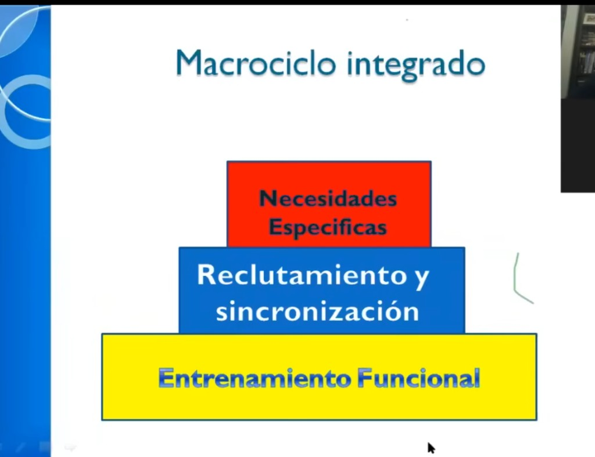

# Macrociclo integrado — Anselmi

> El **macrociclo** es el plan a largo plazo (meses). Anselmi lo organiza en tres capas que se construyen de abajo hacia arriba — no se puede ir a la siguiente sin consolidar la anterior.

---

## Las tres capas

### 1. Entrenamiento Funcional (base — amarillo)
**Qué es:** la capacidad física general. Fuerza, movilidad, resistencia, coordinación básica. Es la capa más ancha porque sostiene todo lo demás.  
**Sin esto:** cualquier trabajo específico encima se derrumba o lesiona.  
**En Diego:** el complemento en casa (circuitos A y B) + el longboard diario. Todo lo que está construyendo ahora es esta capa.

### 2. Reclutamiento y sincronización (medio — azul)
**Qué es:** aprender a usar la fuerza que ya tenés — activar más fibras musculares al mismo tiempo y coordinarlas. Acá entran los ejercicios de coordinación más exigente, los pliométricos básicos y el trabajo de velocidad de ejecución.  
**Sin la base:** el sistema nervioso no tiene "sustrato" para reclutar bien. Por eso va después.  
**En Diego:** todavía no llegamos acá — es el paso siguiente cuando la base funcional esté sólida (varios meses).

### 3. Necesidades Específicas (pico — rojo)
**Qué es:** el trabajo específico del deporte o del objetivo concreto. Para un deportista: gestos de su deporte. Para Diego: podría ser pumping y maniobras de longboard con mayor exigencia neuromuscular, o trabajo explosivo específico.  
**Sin las dos capas de abajo:** no tiene sentido y es riesgo de lesión.  
**En Diego:** fase futura, bien adelante.

---

## Cómo se traduce en tiempo (orientativo para Diego)

| Fase | Capa | Duración estimada | Qué se hace |
|------|------|-------------------|-------------|
| Ahora | Funcional | 3–6 meses | Circuitos A/B, fuerza con mancuernas, longboard diario |
| Siguiente | Reclutamiento | 2–4 meses | Agregar coordinación avanzada, pliométricos básicos (nivel 4), más carga |
| Después | Específica | Continuo | Trabajo explosivo orientado al longboard, gestos técnicos |

> Estos tiempos son orientativos. La capa anterior no se "abandona" — se mantiene como base mientras se agrega la siguiente.

---

## Relación con los otros modelos

- La **capa 1** se construye con microciclos de variaciones 1–3 (carga moderada, progresiva).
- La **capa 2** aparece cuando los ejercicios de nivel 3–4 (coordinación, pliométricos) entran en el plan.
- La **capa 3** requiere mesociclos diseñados alrededor del deporte específico.

---

## Para la app

> Modelo de datos consolidado en [`../app/vision-y-features.md`](../app/vision-y-features.md) — sección *Modelo de datos → Macrociclo*.

---

> Fuente: presentación de Horacio Anselmi (diapositiva "Macrociclo integrado").  
> Relacionado: [`microciclos-anselmi.md`](./microciclos-anselmi.md) · [`organizacion-semanal-anselmi.md`](./organizacion-semanal-anselmi.md) · [`orden-intensidad-anselmi.md`](./orden-intensidad-anselmi.md)
