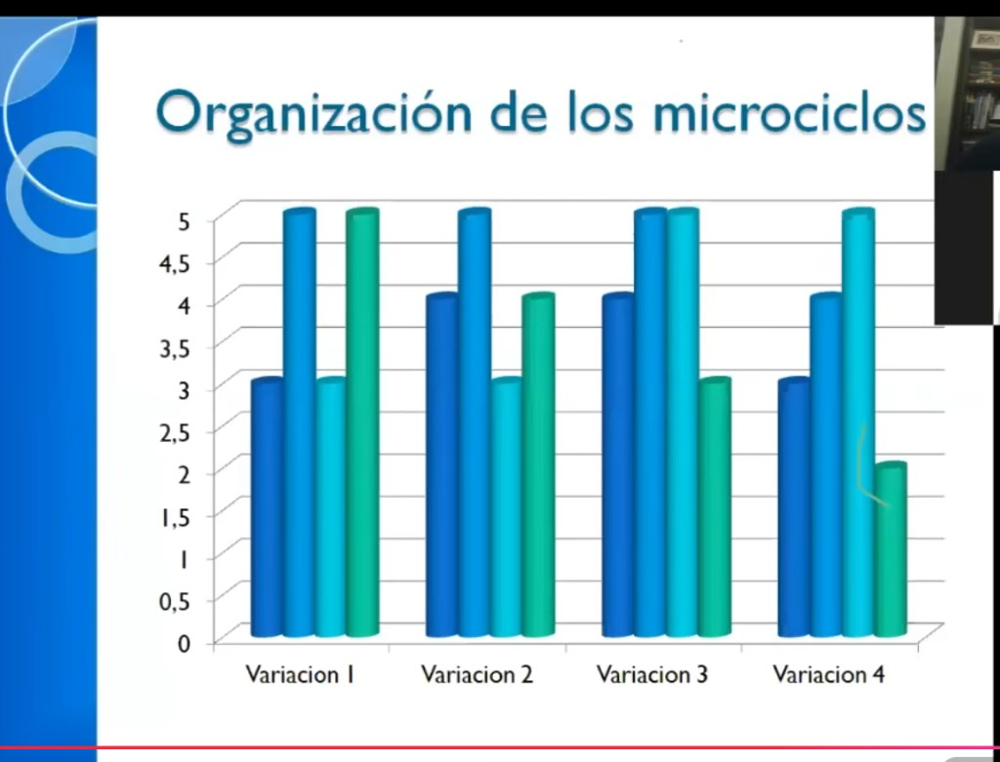

# Organización de los microciclos — Anselmi

> Un **microciclo** es la semana de entrenamiento. Este modelo define cómo distribuir la carga entre las **3 sesiones principales** de esa semana (en Diego: lunes, miércoles y viernes). Los valores están en escala 1–5.

---

## Las 4 variaciones

Cada barra representa una sesión. Los 3 colores son las 3 sesiones del microciclo (sesión 1 → sesión 2 → sesión 3).

| Variación | Sesión 1 | Sesión 2 | Sesión 3 | Patrón |
|-----------|----------|----------|----------|--------|
| **Variación 1** | 3 | 5 | 3 | Valle – Pico – Valle (simétrico) |
| **Variación 2** | 4 | 5 | 4 → 3 | Ascenso – Pico – Descenso |
| **Variación 3** | 4 | 5 | 3 | Medio – Pico – Recuperación |
| **Variación 4** | 3 | 4 | 5 → 2 | Progresivo al pico – Recuperación brusca |

---

## Qué significa cada patrón

**Variación 1 — Valle–Pico–Valle:**  
Arrancás suave, clavás el pico en el medio y cerrás suave. Buena para semanas de carga media o cuando venís cansado. El sistema nervioso se protege en los extremos.

**Variación 2 — Ascenso–Pico–Descenso:**  
Subís progresivamente, llegás al máximo en la sesión 2 y bajás. Más carga total que la 1. Buena para semanas de desarrollo.

**Variación 3 — Medio–Pico–Recuperación:**  
Similar a la 2 pero el cierre baja más. Útil cuando el cuerpo necesita recuperarse antes del fin de semana (sábado pico de longboard).

**Variación 4 — Progresivo al máximo:**  
La sesión 3 es la más dura. Muy agresivo — el sistema nervioso llega cargado al pico. Se usa puntualmente, no como base. El 2 final es recuperación inmediata.

---

## Cómo aplica al plan de Diego

Las 3 sesiones del complemento son: **Lunes (B) → Miércoles (A+Fuerza) → Viernes (A o B)**

| Sesión | Día | Carga relativa (1–5) |
|--------|-----|----------------------|
| 1 | Lunes — Circuito B | ~3–4 |
| 2 | Miércoles — Circuito A + Fuerza | ~5 (pico) |
| 3 | Viernes — A o B | ~3–4 |

Esto corresponde a la **Variación 3**: medio – pico – recuperación. El viernes baja un poco respecto al miércoles, lo que permite llegar al sábado (longboard pico) con algo de frescura.

**Por qué no Variación 4:** poner el pico el viernes dejaría al sábado (que debería ser el pico de longboard) con el sistema nervioso agotado. No tiene sentido con el deporte de Diego.

---

## Cómo variar el microciclo a lo largo de las semanas

No hay que usar siempre la misma variación. Alternar evita la adaptación:

| Semana | Variación sugerida | Por qué |
|--------|--------------------|---------|
| 1–2 (inicio) | Variación 1 | Arrancar suave, que el cuerpo se adapte |
| 3–4 | Variación 3 | Subir carga total, mantener el pico en miércoles |
| 5–6 | Variación 2 | Más volumen total, misma lógica de pico |
| 7–8 | Variación 4 (puntual) | Semana de choque controlada |
| 9 | Variación 1 (descarga) | Semana liviana de recuperación activa |

> Esto es una guía orientativa. El cuerpo manda: si venís muy cargado, retrocedés una variación.

---

## Para la app

> Modelo de datos consolidado en [`../app/vision-y-features.md`](../app/vision-y-features.md) — sección *Modelo de datos → Microciclo*.

---

> Fuente: presentación de Horacio Anselmi (diapositiva "Organización de los microciclos").  
> Relacionado: [`organizacion-semanal-anselmi.md`](./organizacion-semanal-anselmi.md) · [`orden-intensidad-anselmi.md`](./orden-intensidad-anselmi.md)
