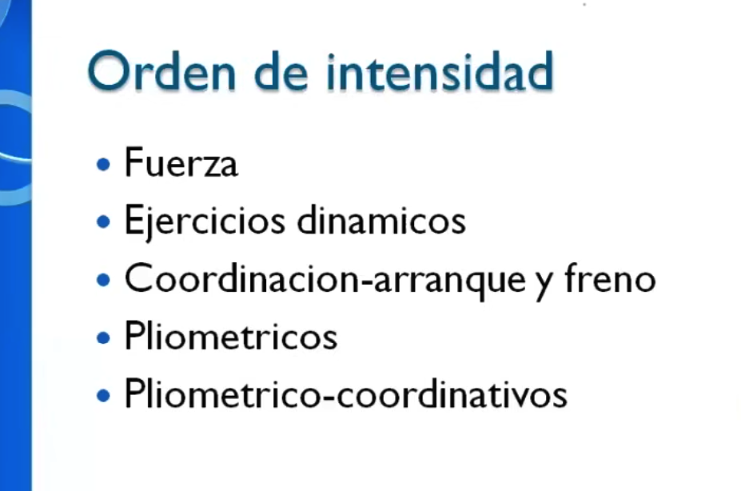

# Orden de intensidad — Anselmi

> Escala de menor a mayor demanda sobre el **sistema nervioso**. Define tanto la **progresión a largo plazo** (qué incorporar primero) como el **orden dentro de una sesión** (hacés primero lo que está más arriba, cuando el sistema nervioso está fresco).

---

## Por qué importa el orden

El sistema nervioso se fatiga antes que el músculo en los ejercicios de alta complejidad. Si hacés pliométricos primero y después fuerza, perdés calidad en ambos. El orden correcto garantiza que cada tipo de estímulo llega cuando el sistema nervioso está en su estado óptimo.

Además, es una **escala de progresión a largo plazo**: no se salta de nivel 1 a nivel 4 sin base. Los pliométricos sin fuerza previa son lesión segura.

---

## Nivel 1 — Fuerza

**Qué es:** producir tensión muscular contra una resistencia con movimiento controlado. El objetivo es que el músculo trabaje, no que el ejercicio sea complejo.  
**Demanda nerviosa:** alta en carga, baja en coordinación.  
**Formato típico:** series × reps con descanso entre series (no circuito).

| Ejercicio | Equipo | Músculos | Notas |
|-----------|--------|----------|-------|
| Sentadilla libre | Nada / mancuernas / barra | Cuádriceps, glúteos, isquios | Base de todo |
| Peso muerto / bisagra | Mancuernas / barra | Isquios, glúteo, erector | Espalda neutra obligatorio |
| Flexión (push-up) | Nada | Pectorales, tríceps, core | Escalar: mesa → rodillas → completa |
| Remo a una mano | Mancuerna + silla | Dorsal, romboides, bíceps | Tirón horizontal |
| Remo inclinado 2 mancuernas | Mancuernas | Dorsal, trapecio, bíceps | Tirón horizontal bilateral |
| Press de hombro | Mancuernas | Deltoides, tríceps | Tirón vertical invertido |
| Puente de glúteos bilateral | Nada | Glúteo mayor, isquios | Base para la versión unilateral |
| Hip thrust (espalda en banco) | Nada / mancuerna | Glúteo mayor | Mayor rango que el puente |
| Plancha frontal (isométrica) | Nada | Core completo, hombros | Fuerza sin movimiento |
| Plancha lateral (isométrica) | Nada | Oblicuos, glúteo medio | Idem, lateral |
| Dominadas / jalón | Barra / polea | Dorsal, bíceps | Tirón vertical — requiere barra |
| Curl de bíceps | Mancuernas | Bíceps | Accesorio de tirón |
| Extensión de tríceps | Mancuerna | Tríceps | Accesorio de empuje |
| Elevación de talón bilateral | Nada / escalón | Gemelos | Base para la versión unilateral |

---

## Nivel 2 — Ejercicios dinámicos

**Qué es:** movimiento controlado a través del rango — sin carga significativa. Incluye movilidad activa, estiramientos dinámicos y ejercicios de calentamiento con patrón fluido. El objetivo es rango de movimiento + activación sin fatiga.  
**Demanda nerviosa:** baja-media. Son los ejercicios de calentamiento y cierre por excelencia.  
**Formato típico:** repeticiones lentas o tiempo sostenido, sin descanso marcado.

| Ejercicio | Equipo | Qué moviliza | Notas |
|-----------|--------|--------------|-------|
| Gato–vaca | Nada | Columna completa | Clásico de activación lumbar |
| Piriforme en prono (paloma) | Nada | Piriforme, cadera externa | Tu versión habitual |
| Figura 4 boca arriba | Nada | Piriforme, glúteo medio | Versión suave de la paloma |
| Marcha rodillas altas | Nada | Flexores de cadera, core | Calentamiento + coordinación básica |
| Zancada atrás lenta | Nada | Cuádriceps, flexor cadera | Sin explosividad, foco en rango |
| Swing de pierna (frontal) | Nada (apoyo en pared) | Flexores/extensores cadera | Péndulo controlado |
| Swing de pierna (lateral) | Nada (apoyo en pared) | Aductores, glúteo medio | Ídem lateral |
| Rotación de tronco de pie | Nada | Columna torácica, oblicuos | Muy útil post-longboard |
| Hip circle (círculos de cadera) | Nada | Cadera 360° | De pie o en cuadrupedia |
| Inchworm | Nada | Isquios, hombros, columna | Caminar con las manos al suelo |
| Estiramiento dinámico de isquios | Nada | Isquios, cadena posterior | De pie, desde la cadera |
| Zancada baja con glúteo apretado | Nada | Flexor cadera, glúteo | Movilidad larga |
| Tobillo en estocada | Nada | Tobillo, gemelo | Rodilla adelante del pie |
| Aductores suaves (mariposa) | Nada | Aductores, cadera interna | Respiración lenta |

---

## Nivel 3 — Coordinación / arranque y freno

**Qué es:** ejercicios que exigen control motor, estabilidad y/o aceleración-desaceleración. El sistema nervioso tiene que coordinar patrones más complejos, muchas veces unilaterales o con cambio de dirección. La carga no es el desafío — la precisión sí.  
**Demanda nerviosa:** media-alta. Se deteriora rápido si hay fatiga nerviosa previa.  
**Formato típico:** reps lentas con foco técnico, o series cortas de arranque/freno.

| Ejercicio | Equipo | Músculos / sistema | Notas |
|-----------|--------|--------------------|-------|
| Bird dog | Nada | Erector, glúteos, core profundo | Control lumbo-pélvico |
| Dead bug | Nada | Transverso, core anti-extensión | Espalda baja pegada siempre |
| Sentadilla búlgara | Silla | Cuádriceps, glúteos, estabilizadores | Unilateral con apoyo |
| Puente glúteos 1 pierna | Nada | Glúteo mayor, core lateral | Pelvis neutra = clave |
| Elevación de talón 1 pierna | Nada / pared | Gemelos, tobillo, propiocepción | Estabilidad de tobillo |
| Equilibrio 1 pierna (estático) | Nada | Tobillo, core, propiocepción | Escalar: ojos abiertos → cerrados |
| Equilibrio 1 pierna + movimiento brazo | Nada | Ídem + demanda cognitiva | Siguiente paso |
| Paso lateral controlado (shuffle lento) | Nada | Glúteo medio, aductores | Arranque-freno lateral |
| Pivot controlado | Nada | Tobillo, rodilla, cadera | Cambio de dirección lento |
| Caminata en zigzag | Nada | Cadena lateral completa | Arranque-freno en diagonal |
| Marcha con cambio de ritmo | Nada | Sistema nervioso, coordinación | Acelerar/frenar cada X pasos |
| Skipping con cambio de dirección | Nada | Coordinación + cardiovascular | Antes de escalar a pliométrico |

---

## Nivel 4 — Pliométricos

**Qué es:** ejercicios que usan el **ciclo estiramiento-acortamiento (CEA)** — el músculo se estira rápido y se contrae de inmediato, como un resorte. Requieren base de fuerza consolidada. Sin esa base, el tendón y la articulación no aguantan la demanda.  
**Demanda nerviosa:** muy alta. Solo cuando el sistema nervioso está fresco.  
**Prerequisito:** mínimo 8–12 semanas de fuerza base sólida y sin dolor articular activo.  
**Formato típico:** pocas reps (4–8), descanso completo entre series, foco en calidad del salto y la recepción.

| Ejercicio | Equipo | Músculos | Notas |
|-----------|--------|----------|-------|
| Salto vertical | Nada | Cuádriceps, glúteos, gemelos | El más básico — medir altura |
| Salto horizontal (broad jump) | Nada | Ídem | Distancia como métrica |
| Salto en caja (box jump) | Caja/banco firme | Ídem + propiocepción | Recepción suave, sin ruido |
| Drop jump | Caja | Ídem + tendón de Aquiles | Bajás y saltás de inmediato |
| Salto lateral | Nada | Glúteo medio, gemelos | Lado a lado |
| Salto con cuerda | Cuerda | Gemelos, coordinación básica | Doble apoyo primero |
| Bounding (zancadas de velocidad) | Nada | Isquios, glúteos, gemelos | Zancada larga y reactiva |
| Skipping rápido | Nada | Flexores cadera, gemelos | Rodillas altas + velocidad |
| Push-up pliométrico (manos al aire) | Nada | Pectorales, tríceps | Requiere base de flexiones sólida |
| Sentadilla con salto | Nada | Cuádriceps, glúteos | Bajar controlado, saltar explosivo |

---

## Nivel 5 — Pliométrico-coordinativos

**Qué es:** explosividad + patrón complejo simultáneo. Cambio de dirección, recepción en 1 pierna, giro en el aire, sprint + frenada. Es el nivel más alto de demanda del sistema nervioso. Propio de deportistas con base consolidada en los 4 niveles anteriores.  
**Demanda nerviosa:** máxima.  
**Prerequisito:** dominio del nivel 4 + control técnico impecable en coordinación (nivel 3).  
**Formato típico:** series muy cortas (2–5 reps), descanso largo, solo en la parte inicial de la sesión.

| Ejercicio | Equipo | Sistema | Notas |
|-----------|--------|---------|-------|
| Salto lateral + giro 90° | Nada | Coordinación + CEA | Aterrizar orientado |
| Salto + recepción 1 pierna | Nada | CEA + estabilidad | La recepción no hace ruido |
| 5-10-5 (cone drill) | 3 conos | Sprint + freno + dirección | Clásico de deporte de equipo |
| T-drill | 4 conos | Velocidad + cambio de dirección | Shuffle + sprint combinados |
| Sprint + frenada brusca | Nada / línea | Desaceleración + control | El freno es el desafío |
| Salto con cuerda + cambio de pie | Cuerda | Coordinación + frecuencia | Un pie alternado rápido |
| Escalera de coordinación (agility ladder) | Escalera | Patrón neuromotor complejo | Mil variantes de paso |
| Salto en caja + sprint inmediato | Caja | CEA + aceleración | Reacción post-aterrizaje |
| Bounding con cambio de dirección | Nada | CEA + coordinación lateral | Requiere dominar bounding base |

---

## Dónde está el plan actual

| Nivel | Estado | Dónde aparece |
|-------|--------|---------------|
| **1 — Fuerza** | ✓ Activo | Circuito A + Bloque de fuerza (miércoles y viernes) |
| **2 — Dinámico** | ✓ Activo | Calentamiento + cierre todos los días con circuito |
| **3 — Coordinación** | ✓ Activo | Circuito B + algunos ejercicios del A |
| **4 — Pliométrico** | — Pendiente | Requiere base de fuerza consolidada (varios meses) |
| **5 — Pliométrico-coord.** | — Pendiente | Después del nivel 4 |

El longboard en sí cae principalmente en **nivel 2–3**: push y pumping tienen arranque-freno, el surf suave es dinámico. No es nivel 4 porque no hay ciclo estiramiento-acortamiento reactivo explícito — aunque el pumping intenso se acerca.

---

## Para la app (atributos de cada ejercicio)

> Schema completo de ejercicios consolidado en [`../app/vision-y-features.md`](../app/vision-y-features.md) — sección *Modelo de datos → Ejercicio*.  
> Archivo de referencia técnica: [`../ejercicios/schema.md`](../ejercicios/schema.md)

> Referencia del marco general: [`../referentes/horacio-anselmi-marco-y-vinculos.md`](../referentes/horacio-anselmi-marco-y-vinculos.md)  
> Plan actual: [`../planes/longboard-complemento/plan-complemento-casa-longboard.md`](../planes/longboard-complemento/plan-complemento-casa-longboard.md)
