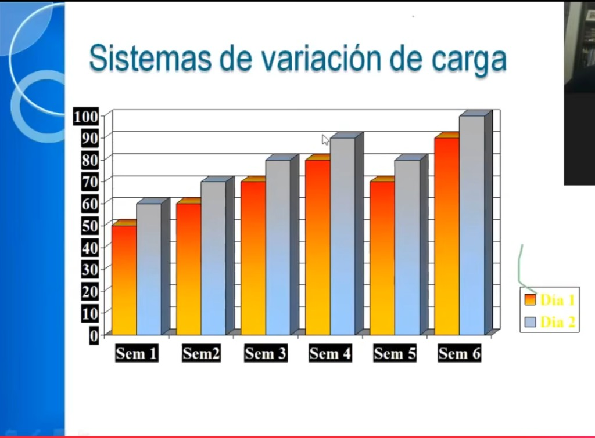

# Sistemas de variación de carga — Anselmi

> Cómo evoluciona la carga **semana a semana** a lo largo de un bloque de 6 semanas (mesociclo). El gráfico muestra Día 1 y Día 2 dentro de cada semana — la carga de cada sesión sobre una escala de 0–100.

---

## Lo que muestra el gráfico

| Semana | Día 1 | Día 2 | Patrón |
|--------|-------|-------|--------|
| Sem 1 | ~50 | ~60 | Inicio suave |
| Sem 2 | ~62 | ~68 | Sube |
| Sem 3 | ~68 | ~78 | Sube más |
| Sem 4 | ~80 | ~90 | Pico del bloque |
| **Sem 5** | **~68** | **~80** | **Descarga (deload)** |
| **Sem 6** | **~90** | **~100** | **Nuevo máximo — supercompensación** |

---

## Las dos leyes que ilustra

### 1. Progresión con ondulación
No se sube carga todas las semanas de forma lineal. Se sube 3–4 semanas, se baja una (semana 5), y se vuelve a subir por encima del techo anterior (semana 6). Ese rebote por encima del techo previo es la **supercompensación** — el cuerpo adaptado supera su propio máximo anterior.

### 2. Día 2 siempre por encima de Día 1
Dentro de cada semana, la segunda sesión es más exigente que la primera. Esto conecta con el modelo de microciclos: arrancás más suave y el pico viene después en la semana.

---

## La semana de descarga (Sem 5) — clave

La semana 5 no es "perder lo ganado" — es **necesaria** para que la semana 6 pueda superar el máximo anterior. Sin descarga, el sistema nervioso llega al techo y no puede subir más. Con descarga, llega fresco y rompe el techo.

Señales de que necesitás una semana de descarga antes de lo previsto:
- Rendimiento que cae aunque el esfuerzo es el mismo
- Sueño peor o más cansancio general
- Motivación baja para entrenar
- Lumbar o articulaciones que avisan más de lo habitual

---

## Aplicado al plan de Diego (6 semanas)

Las unidades son relativas — lo que importa es el patrón:

| Semana | Microciclo | Carga relativa | Notas |
|--------|-----------|----------------|-------|
| 1 | Variación 1 (3-5-3) | Baja-media | Arranque, adaptación |
| 2 | Variación 2 (4-5-4) | Media | Subiendo |
| 3 | Variación 3 (4-5-3) | Media-alta | Subiendo |
| 4 | Variación 2 o 3 + carga extra | Alta | Pico del bloque |
| **5** | **Variación 1 (3-5-3)** | **Baja — descarga** | **Valle intencional** |
| **6** | **Variación 2 con carga máxima** | **Máxima** | **Supercompensación** |

Después de la semana 6: nuevo bloque de 6 semanas, arrancando desde un piso más alto que el bloque anterior.

---

## Para la app

> Modelo de datos consolidado en [`../app/vision-y-features.md`](../app/vision-y-features.md) — sección *Modelo de datos → Mesociclo*.

---

> Fuente: presentación de Horacio Anselmi (diapositiva "Sistemas de variación de carga").  
> Relacionado: [`microciclos-anselmi.md`](./microciclos-anselmi.md) · [`macrociclo-integrado-anselmi.md`](./macrociclo-integrado-anselmi.md)
